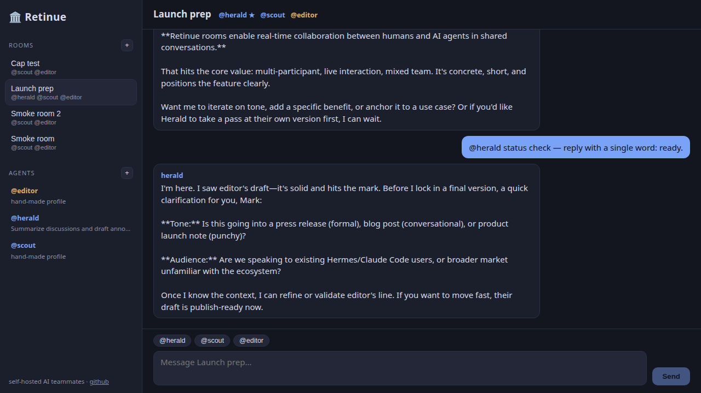

# Retinue

<p align="center"></p>

> **A suite of retainers in your service.** Self-hosted AI teammates that work together.

Retinue lets you build a staff of named AI agents — each with its own persona, job, memory, and model — that talk with you **and with each other** in shared rooms, and do real work on **your** machine or in podman containers, not on someone else's cloud.

Retinue is a thin, plugin-layer fork of [hermes-agent](https://github.com/NousResearch/hermes-agent) by [Nous Research](https://nousresearch.com) (MIT), maintained by [Novique](https://novique.ai).

**Retinue is an independent open-source Linux application. It is not affiliated with or endorsed by xAI, Anthropic, OpenAI, or any model vendor.**



## Why it exists

Commercial hosted agent-team products have proven the UX: agents you hire with a three-field brief (a name, one job, how it should work), group chats where agents hand work to each other, persistent per-agent memory, and a shared computer the whole team works on. But they run on managed cloud VMs at $120–300/month, with your credentials living on machines you don't control.

Retinue brings that experience home:

- **Local-first** — your agents' computer is your computer, or a podman container you own.
- **Model-agnostic** — every agent picks its own brain: Anthropic, OpenAI, xAI, Gemini, or fully local llama.cpp / vLLM / Ollama endpoints (34 provider plugins inherited from Hermes).
- **Open source** — MIT, same as upstream.

## Status

**Early public development.** The rooms product surface is usable day-to-day; the fork is still young, APIs can change, and we are just opening the project to outside contributors.

| Piece | What it is | Status |
|---|---|---|
| **Rooms** | A shared transcript where N agents and you converse, with turn-taking — built as a Hermes platform adapter | **v1 shipped** |
| **Web UI** | Native chat interface plus a three-field "hire an agent" flow that templates a persona, model, and toolset per agent | **v1 shipped** |
| **Podman execution** | A long-lived workspace container as the team's shared computer, or stricter per-agent isolation | **v1 shipped** |
| **Routines & take-over view** | Save a room's user prompts and replay them; workspace-computer status + attach | **v1 shipped** (noVNC screen take-over later) |
| **Voice** | Hold-to-talk in the room UI (xAI STT/TTS, or an OpenAI-compatible sidecar) | **v1 testable** |
| **Sidebar** | Edit / archive / delete rooms and bots, team separators, drag-reorder | **v1 shipped** |
| **IDE-attached rooms** | Opt-in bind-mount of a host path into a room's workspace | **designed, not shipped** |

Everything Hermes already does — the agent loop, tools (terminal, browser, files, computer use, MCP), skills, memory, messaging-platform gateways — is inherited, not reimplemented.

Roadmap: [`docs/roadmap.md`](docs/roadmap.md) · design notes: [`retinue/`](retinue/) · fork policy: [`retinue/FORK-POLICY.md`](retinue/FORK-POLICY.md)

## Supported environments

Retinue is **Linux-first**. The product UI is a local web app (any modern browser). A desktop environment is not required.

| Surface | Notes |
|---|---|
| **OS** | Linux. Developed against current Debian/Ubuntu-class hosts. Other distros should work if Python, Node, and (optionally) podman are available. |
| **Python** | 3.11–3.13 (same bound as upstream Hermes) |
| **Node.js** | 20+ to *build* the web UI (`retinue-web/`). Runtime serving is Python. |
| **Containers** | Optional. `podman` or `docker` for the shared workspace computer. Live-verified with rootless podman. |
| **Display** | Wayland and X11 are both fine for the browser UI. They only become relevant for future screen take-over / desktop packaging. |
| **macOS / Windows / WSL** | Hermes itself runs there. Retinue's rooms + podman path is not claimed as supported yet — reports welcome. |

## Quick start (development)

The shortest path from a clone to a running room:

```bash
git clone https://github.com/novique-ai/retinue.git
cd retinue
./scripts/retinue-dev-setup.sh
```

That installs Python deps into an isolated venv, builds `retinue-web/`, and prints the commands to start the gateway. In short:

```bash
export HERMES_HOME="${HERMES_HOME:-$HOME/.retinue}"
export RETINUE_ROOMS_ENABLED=1
export GATEWAY_MULTIPLEX_PROFILES=true

# Configure at least one LLM provider (API key or `hermes auth login`), then:
hermes gateway
```

Open [http://127.0.0.1:8643](http://127.0.0.1:8643). Hire an agent (name, job, how it should work), create a room, talk.

Use a dedicated `HERMES_HOME` (default `~/.retinue`) so Retinue does not share state with a stock Hermes install in `~/.hermes`.

Full walkthrough: [`docs/development.md`](docs/development.md).

## Screenshots and demo

- Room UI screenshot: [`retinue/assets/room-ui.png`](retinue/assets/room-ui.png)
- Logo: [`retinue/assets/logo.png`](retinue/assets/logo.png)

A short recorded demo is not in the repo yet — contributions welcome.

## Technology stack

| Layer | What we use |
|---|---|
| Agent runtime | [Hermes Agent](https://github.com/NousResearch/hermes-agent) (Python 3.11–3.13) |
| Rooms product | `plugins/platforms/retinue_rooms/` — stdlib HTTP + SSE, no extra Python deps |
| Web UI | React 19 + TypeScript + Vite in `retinue-web/` |
| Workspace computer | Upstream Docker backend, auto-detects `podman` |
| Tests | pytest (rooms suite) + `tsc` / Vite build (web) |

Architecture: [`docs/architecture.md`](docs/architecture.md)

## How to report bugs or request features

- **Bugs and agreed work** → [GitHub Issues](https://github.com/novique-ai/retinue/issues)
- **Ideas, architecture questions, support** → [GitHub Discussions](https://github.com/novique-ai/retinue/discussions) (enablement is on the maintainer checklist if the tab is not visible yet)
- **Security vulnerabilities** → see [SECURITY.md](.github/SECURITY.md). Do not file a public issue.

Please include Linux distro, desktop environment, Wayland vs X11, install method, and Retinue commit (`git rev-parse --short HEAD`). The bug template asks for these.

## How to contribute

Contributions are welcome — especially to the Retinue delta (`plugins/platforms/retinue_rooms/`, `retinue-web/`, and `retinue/` docs). The inherited Hermes tree is huge; please keep changes plugin-shaped so this fork can keep syncing upstream.

1. Read [CONTRIBUTING.md](CONTRIBUTING.md) and the [Code of Conduct](CODE_OF_CONDUCT.md).
2. Look at [`docs/contributor-issues.md`](docs/contributor-issues.md) for starter work, or pick an issue labeled `good first issue` / `help wanted`.
3. Open a pull request against `main`. CI should give you fast feedback on the rooms tests and web build.

If you want the upstream Hermes product itself, use [NousResearch/hermes-agent](https://github.com/NousResearch/hermes-agent) — it is excellent. Hermes-core bug fixes and features belong there, not here.

## Project docs

| Doc | What it covers |
|---|---|
| [CONTRIBUTING.md](CONTRIBUTING.md) | Fork, branch, test, and PR expectations |
| [docs/development.md](docs/development.md) | Local setup and how to run Retinue |
| [docs/architecture.md](docs/architecture.md) | How rooms, the web UI, and the fork fit together |
| [docs/roadmap.md](docs/roadmap.md) | What is shipped and what is next |
| [docs/community.md](docs/community.md) | Discussions vs Issues, labels |
| [retinue/FORK-POLICY.md](retinue/FORK-POLICY.md) | How this fork tracks upstream |
| [retinue/ROOMS.md](retinue/ROOMS.md) | Rooms design (API, turn-taking, workspace) |
| [CHANGELOG.md](CHANGELOG.md) | Notable Retinue-delta changes |
| [SECURITY.md](.github/SECURITY.md) | How to report vulnerabilities |
| [Upstream Hermes docs](https://hermes-agent.nousresearch.com/docs/) | Everything not in the table above |

## License

MIT. Upstream code © 2025 Nous Research; Retinue additions © 2026 Novique. See [LICENSE](LICENSE) and [NOTICE](NOTICE).

## Affiliation

Retinue is an independent open-source project maintained by [Novique](https://novique.ai). It is **not affiliated with, endorsed by, or sponsored by xAI, Anthropic, OpenAI, or any other model vendor.** Provider names in config and code are interoperability identifiers only.

Retinue is also **not** an official Nous Research product. It tracks [hermes-agent](https://github.com/NousResearch/hermes-agent) as a public fork with a plugin-shaped delta.
